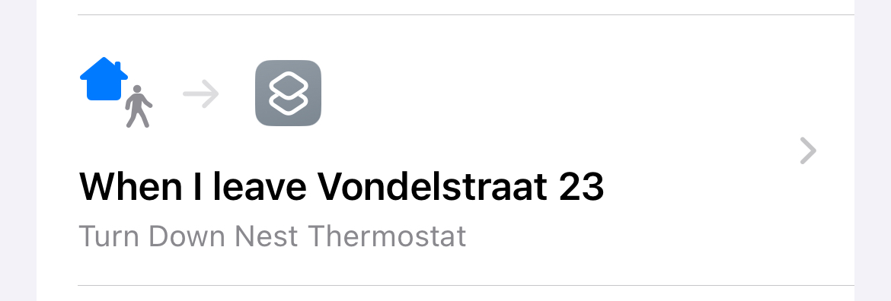
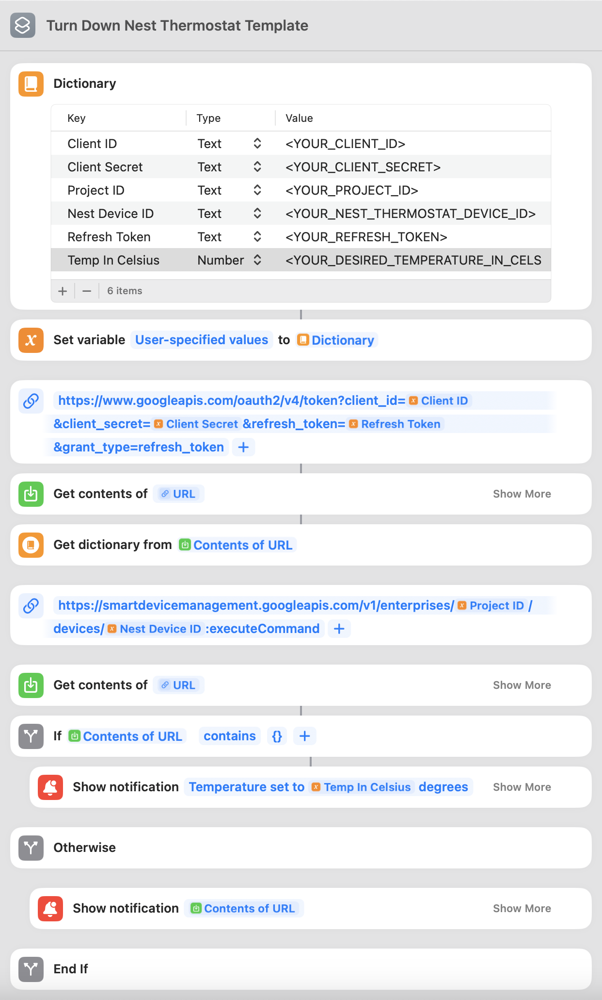

# iOS Shortcut for Controlling Nest Thermostat

This repository contains an [iOS Shortcut](https://support.apple.com/guide/shortcuts/welcome/ios) that allows you to automatically adjust the temperature of your Nest thermostat to a specified temperature, and is compatible with any generation of Nest Thermostat (without requiring a separate hub or Matter support). It enables Nest automations not currently supported via Apple's current Home automation, such as turning off your Nest Thermostat whenever you leave the house.

Given [all Nest thermostats except for the 2020 model are incompatible with Apple's Home automation suite / Homekit](https://9to5google.com/2023/05/11/nest-thermostat-homekit-matter-set-up/), this iOS shortcut uses a workaround by directly interacting with Google's Device Access API for Nest. As this API is secured using OAuth2, you will first need to register for Google Nest developer access and go through a few developer-oriented steps before the Shortcut can be used. 

## Example automation enabled by the shortcut

## How To Use

### 1. Enroll for Google's Nest Device Access API and register your Nest Device

Complete the first two steps ('Get Started' and 'Authorize an Account') described in the [Google Nest Device Access documentation](https://developers.google.com/nest/device-access/get-started). Complete all steps up to and including "How to use a refresh token". While walking through these steps, make sure to note down the following variables, which you will need to populate in the iOS Shortcut before you can trigger it:
- Client ID
- Client secret
- Refresh token
- Project ID 
- Device ID (for your already installed Nest thermostat)
    - This can be retrieved from the response for the request performed in the [Make a device list call](https://developers.google.com/nest/device-access/authorize#make_a_device_list_call) step

### 2. Install the shortcut on your iPhone

Installing the shortcut on your iPhone can either be achieved by opening the 'Nest Thermostat Control.shortcut' file in this repository on your iPhone (or other Apple device), or by opening the following link: https://www.icloud.com/shortcuts/b62f4f9adbec47c8b14d2dda57db094b. 

### 3. Populate the Dictionary

When opening the iOS Shortcut after installation, you should see all of the automation steps of the shortcut. At the top you can see a 'Dictionary' section with a few placeholders for custom values (e.g. Client Secret, Client ID). You need to replace the values in the ‘Value’ fields of the Dictionary (e.g. '<YOUR_CLIENT_ID>') with the variables you gathered during the first step.

### 4. (Optional) Define certain events that should trigger the automation
Enable the automation to trigger based on certain events, such as 'when I leave home', 'when I leave work', or 'when I join a wi-fi network'.

## How it works

